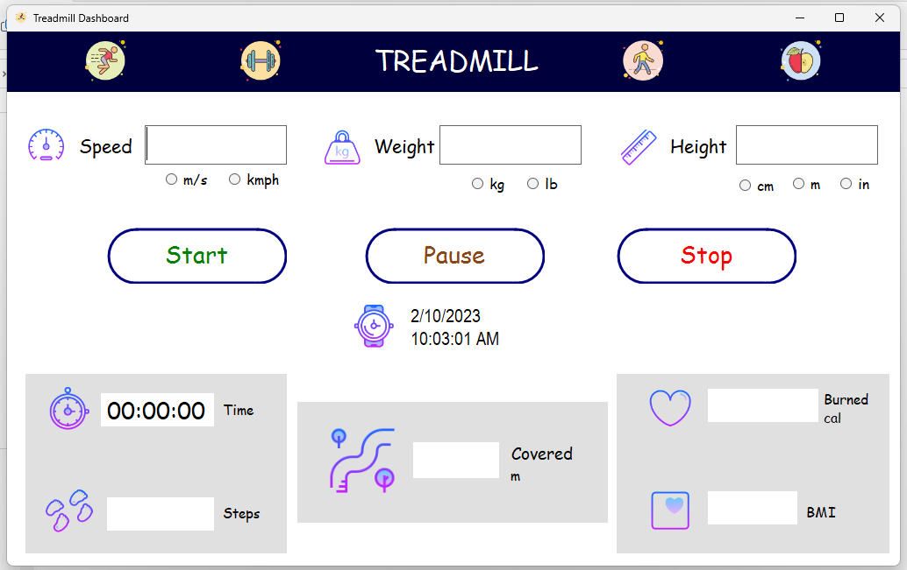
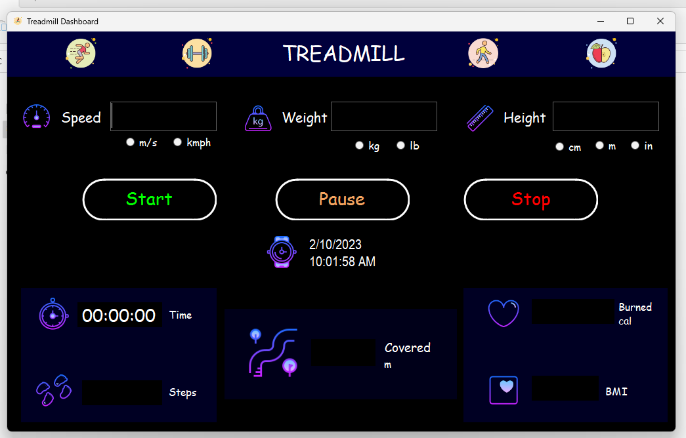

# Treadmill-Dashboard

Treadmill Dashboard is a user-friendly application that helps track and monitor the performance of your treadmill. The dashboard comes with two modes: Light mode and Dark mode. You can switch between the modes according to your preference and lighting conditions.

## Features
- Real-time display of speed, distance, and calories burned
- Option to switch between Light mode and Dark mode
- User-friendly interface
- Accurate tracking of performance according to given data 

## Getting Started
- The software is already build.
- Download the .exe from bin/Release.
- Run the software.

## Technical Details
The Treadmill Dashboard is built using C# and .NET. The application is designed to provide a smooth and seamless user experience while tracking your treadmill performance. It's simple and easy to use.

## Contact
If you have any questions or feedback, please feel free to reach out to the project maintainers. We are always looking for ways to improve the Treadmill Dashboard and would love to hear from you.

## Screenshots

  
  

